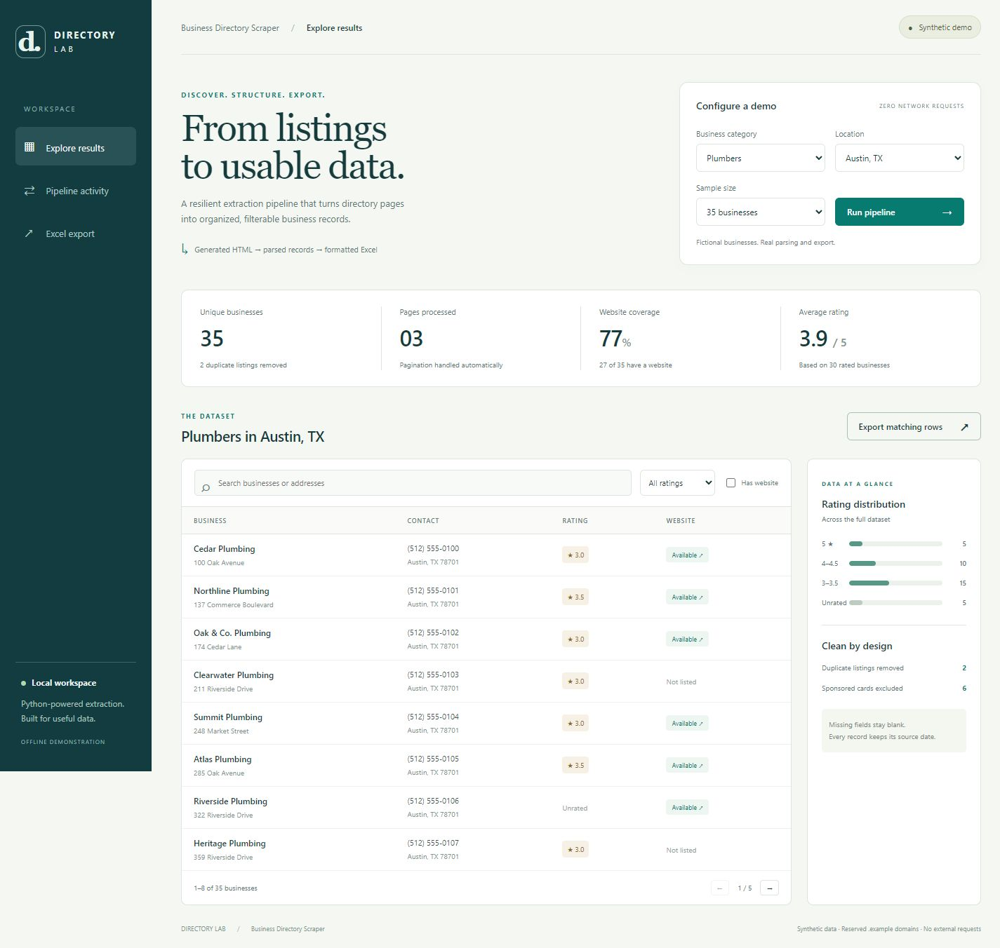
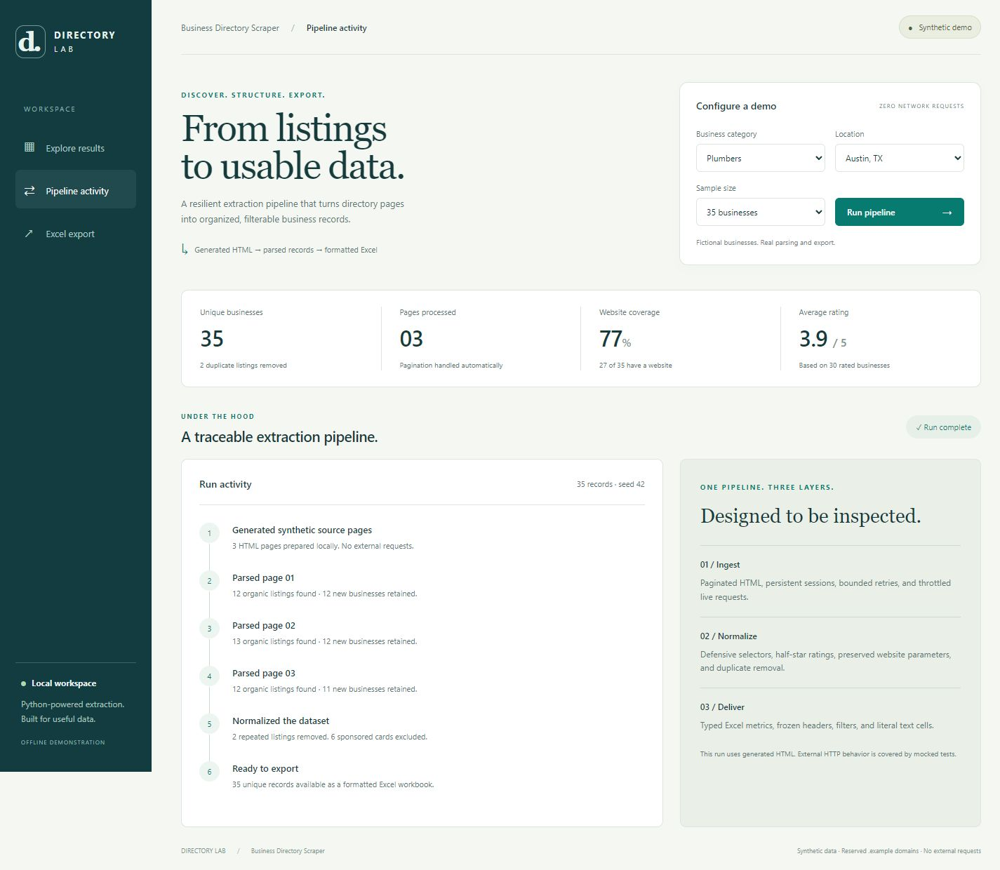

# Directory Lab · Business Directory Scraper

A Python data-extraction project that turns paginated business listings into structured, filterable records and a formatted Excel workbook. A local dashboard makes the pipeline easy to demonstrate without accessing a third-party directory.

**Python 3.11+ · BeautifulSoup · curl_cffi · pandas · openpyxl · Vanilla JavaScript · MIT**



## Try it locally

```bash
python -m venv .venv
# Windows:
.venv\Scripts\activate
# macOS / Linux:
# source .venv/bin/activate
python -m pip install -r requirements.txt
python directory_scraper.py --serve
```

Open **http://127.0.0.1:8765**. On Windows, **Start-Demo.cmd** creates the local environment, installs dependencies, and starts the same dashboard. It requires Python 3.11+ (or the existing bundled Python runtime on a Codex desktop installation).

The dashboard binds only to `127.0.0.1`. Stop the server with Ctrl+C. If the port is busy, use `--serve --port 8766`. This is a local demonstration server, not a public hosting configuration.

For a terminal-only demonstration:

```bash
python directory_scraper.py --demo --output exports/plumbers_demo.xlsx
python directory_scraper.py --demo --category dentists --city "Chicago, IL" --count 75
```

Dependency installation needs network access; the running demo uses only local requests and generated data.

## What the demonstration shows

1. Generate synthetic HTML pages with organic listings, sponsored cards, and repeated listings at page boundaries.
2. Walk those pages using the same pagination and parsing code as the live scraper.
3. Remove advertisements and duplicate records; preserve missing fields as blanks.
4. Search by name or address, filter by rating and website availability, and page through the results.
5. Inspect page-by-page activity and download exactly the matching records as Excel.

The default run produces **35 unique businesses from 3 pages**, removing **2 repeated listings and 6 sponsored cards**. The screenshots show synthetic data, not a live collection. Demo websites use reserved `.example` domains and phone numbers use the fictional `555-0100`–`555-0199` range. The default seed is 42; the collection date follows the current date.



## Engineering choices

| Concern | Implementation |
|---|---|
| Data integrity | Whitespace-aware extraction, half-star ratings, missing-field handling, and tracking-parameter removal that keeps functional URL parameters |
| Pagination | Relative URL resolution, same-host traversal, repeated-URL detection, a page cap, and record deduplication |
| HTTP behavior | A reused session, a 20-second request timeout, bounded retries, 3–7 second delays between pages, and immediate stops on permanent HTTP errors |
| Failure visibility | Unrecognized HTML is treated as a failed fetch; partial results retain a warning and return a nonzero exit code |
| Safe exports | Scraped values remain literal text; illegal Excel control characters are removed; files are written atomically |
| Usable workbooks | Numeric ratings/review counts, actual date values, frozen headers, filters, column sizing, and a separate source-notes worksheet |
| Reproducibility | A local seeded random generator; the demo exercises production parsing without creating an HTTP session |
| Simple distribution | Dashboard uses the Python standard-library HTTP server and plain HTML/CSS/JavaScript, with no JavaScript build step |

The HTML selectors are specific to Yellow Pages-style markup. Other directories need their own selector adapter. The `Business` record model and export code can be reused independently.

## CLI reference

| Flag | Default | Purpose |
|---|---|---|
| `--serve` | off | Serve the local offline dashboard |
| `--port` | 8765 | Local dashboard port |
| `--demo` | off | Run synthetic HTML through the parser and export it |
| `--category` | plumbers | Business category |
| `--city` | Austin, TX | City/location label |
| `--count` | 35 | Demo record count, 1–1000 |
| `--seed` | 42 | Demo random seed |
| `--max-pages` | 5 | Live pagination limit; must be positive |
| `--output` | generated filename | `.xlsx` destination; parent directories are created |

Dashboard choices are plumbers/dentists/electricians and Austin/Chicago/Seattle, with sample sizes 35/75/120. CLI category, city, and demo counts are more flexible. Unknown demo locations omit the ZIP code instead of reusing Austin's ZIP codes. `--serve` uses the dashboard's controls for its configuration.

Exit codes: **0** successful export, **1** no results or operational failure, **2** invalid arguments or a partial export, **130** interrupted. A partial export prints `[PARTIAL]` and records the warning in its workbook. Reaching the user-selected page cap is a bounded successful run, not an assertion that the entire directory was collected.

Logging goes to the console. Importing the module does not create files. To keep a log, redirect console output explicitly.

## Live mode and limits

Without `--demo` or `--serve`, the CLI retains its live Yellow Pages search path:

```bash
python directory_scraper.py --category plumbers --city "Austin, TX" --max-pages 3 --output plumbers_live.xlsx
```

Use a source only when you have permission and its terms allow your intended access. The app stops on access denials; it does not solve access challenges. The dashboard exposes only the offline demo.

**Live Yellow Pages compatibility was not verified in this review.** External layouts and access policies can change. Transport behavior is tested with mocked responses; those tests do not establish current compatibility with the live website. An unrecognized empty-results layout may be reported as a failure, which is preferable to silently claiming that a blocked request returned no businesses.

Deduplication uses normalized name, phone, street address, and locality. Records with different contact/address details are kept, including different branches; this is exact-record deduplication, not fuzzy entity resolution.

## Development and verification

```bash
python -m pip install -r requirements-dev.txt
python -m pytest -q
python -m ruff check .
```

The reviewed build passed **60 tests** on Windows with Python 3.12. Tests cover extraction, pagination, mocked transport errors, CLI exits, typed workbook round trips, formula-safe cells, and actual localhost API/export responses. No external site is contacted by the tests. The repository CI configuration runs lint and tests on Python 3.11 and 3.12; remote CI was not run as part of this local review.

The browser walkthrough additionally checked search, empty states, pagination, combined filters, category/location changes, desktop/mobile layouts, and workbook generation. See [REVIEW.md](REVIEW.md) for the reproduced defects and evidence.

## More detail

- [Filtered results](docs/screenshots/02-filtered-results.jpg)
- [Excel export preview](docs/screenshots/04-excel-export.jpg)
- [Generated sample workbook](plumbers_austin_sample.xlsx)

## License

MIT — see [LICENSE](LICENSE).
